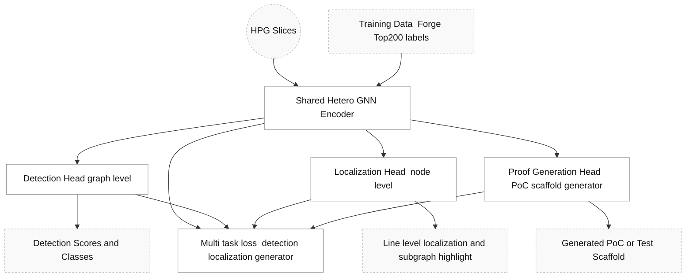
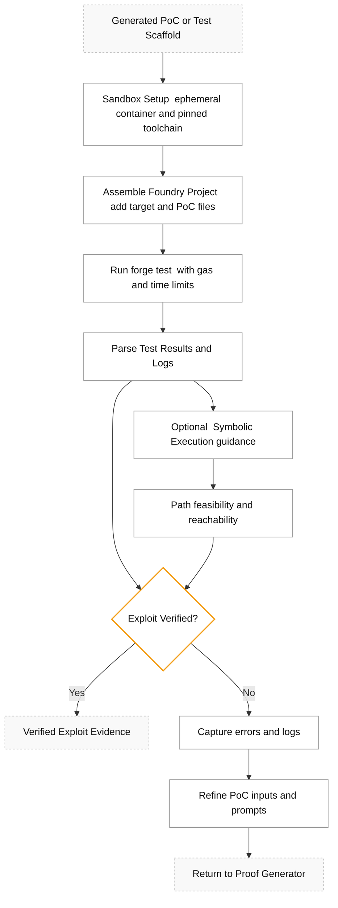
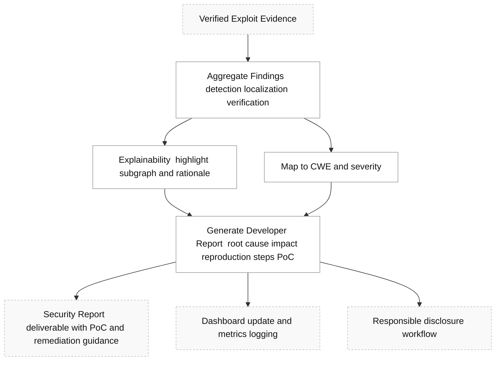

## Overall Architecture

```mermaid
flowchart TD
  classDef mod fill:#eef,stroke:#88a,stroke-width:1px,color:#111;
  classDef step fill:#fff,stroke:#999,stroke-width:1px,color:#111;
  classDef decision fill:#fff,stroke:#f39c12,stroke-width:2px,color:#111;
  classDef io fill:#f9f9f9,stroke:#bbb,stroke-dasharray:3 3,color:#111;

  S([Start]):::step --> SRC[Solidity Source Code]:::io
  SRC --> M1["Module 1  Program Representation"]:::mod
  M1 --> M2["Module 2  Learning and Detection"]:::mod
  M2 --> D1{Vulnerability Detected?}:::decision
  D1 -- No --> END_NO([End  No Finding]):::step
  D1 -- Yes --> M3["Module 3  Exploit Verification"]:::mod
  M3 --> VVER[Verified Evidence]:::io
  VVER --> M4["Module 4  Analysis and Reporting"]:::mod
  M4 --> REPORT[Security Report and PoC]:::io --> END_YES([End  Verified Finding]):::step
 ```


 ## Module 1 — Foundational Program Representation

 ```mermaid
 flowchart TD
  classDef mod fill:#eef,stroke:#88a,stroke-width:1px,color:#111;
  classDef step fill:#fff,stroke:#999,stroke-width:1px,color:#111;
  classDef io fill:#f9f9f9,stroke:#bbb,stroke-dasharray:3 3,color:#111;

  SRC[Solidity Source Code]:::io --> AST[AST Generation]:::step
  AST --> SYM[Symbol Table and Types]:::step
  ANCH[Anchor Vocabulary  literature and audits]:::io --> MATCH[Anchor Matching]:::step
  AST --> MATCH
  MATCH --> SLICE[Semantic Slicing  control and data deps]:::step
  SLICE --> HPG[HPG Construction  AST CFG DFG inter contract edges]:::step
  HPG --> HPG_OUT((Rich HPG Slices)):::io

  %% notes
  subgraph Notes[" "]
    direction TB
    N1[Anchor sources include CWE patterns and audit corpus]:::io
    N2[Slice depth controlled by config and heuristics]:::io
  end
```

## Module 2 — Core Learning and Detection



## Module 3 — Automated Exploit Verification



## Module 4 — Analysis and Reporting

